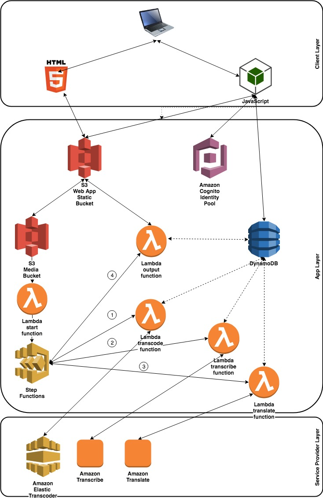

# Serverless Subtitles

Serverless Subtitles is a demonstration project which allows you to prove the
usage of several AWS Products.

Original idea by Maxime THOMAS - maxthom@amazon.com
Open Source Code under [Apache License](LICENSE)

## Pitch

You have a video but it's in english and you have difficulties to understand it.

Serverless Subtitles can handle a video input, extract the sound, transcript it
and generate different subtitle files for your video.

When the file is processed, you can access to a preview of the video with
different generated languages.

Examples of the different VTT format files generated :
[EN](./doc/en.vtt) |
[FR](./doc/fr.vtt)

## TL;DR

This is working *only* in us-east-1 region so far.

    $ cd cloudformation;
    $ export USERNAME=<unique user id with only chars>
    $ ./create-all.sh

## AWS Services demonstrated

**Elastic Transcoder** :

Transcode is a service allowing you to transform videos.
We use it to extract the sound of a MP4 file to a MP3 file.

https://aws.amazon.com/en/elastictranscoder/

**Transcribe**

Transcribe is a service allowing you to transform speech to text.
We use it to get the transcript of the MP3 file.

https://aws.amazon.com/en/transcribe/

**Translate**

Translate is a service allowing you to translate text file in different
languages. We use it to translate subtitle files.

https://aws.amazon.com/en/translate/

## Solution Architecture

## Set up

You must define a unique user id with only chars to setup this project.

We do so to avoid Bucket Name collision.

    $ cd cloudformation;
    $ export USERNAME=<unique user id with only chars>
    $ ./create-all.sh

The script will do the following :

* apply all cloudformation templates from the _cloudformation/templates_
directory
* set up the project :
    * uploading the lambdas functions;
    * creating mandatory keys in the S3 buckets;
    * generating a config file for the static website so JS client can directly
    access the resources with good arns.
* when everything is ready (about 2 min), you will get an url that should be
  like : http://subtitle.static.&lt;username&gt;.aws.com.s3-website-us-east-1.amazonaws.com/

## Set down

    $ cd cloudformation
    $ ./delete-all.sh

## License

This library is licensed under the Apache 2.0 License.
